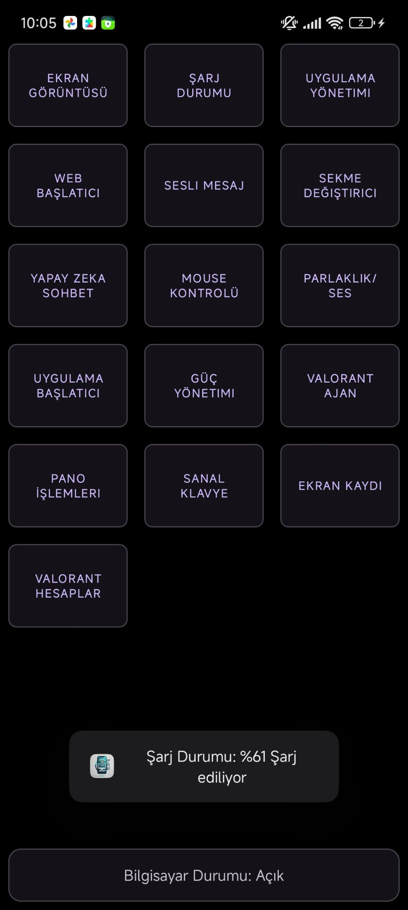
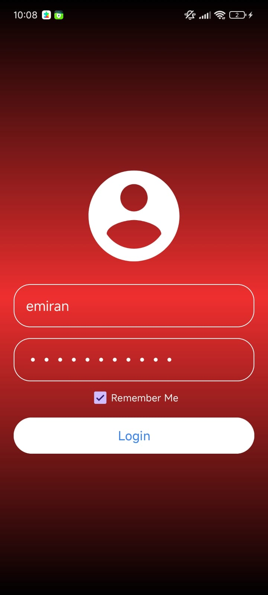
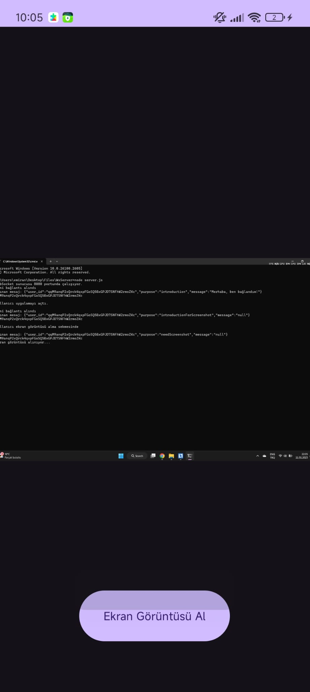
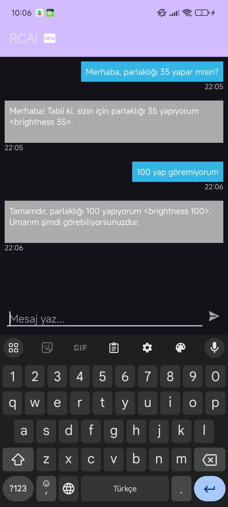

[For English version click here](Readme_en.MD)

> **⚠️ Dikkat:**  
> Hala geliştirilme aşamasında olduğundan ve birçok API anahtarıyla kişisel bilgiler içerdiğinden dolayı kaynak kodları henüz tamamen kullanılabilir değildir. Bu repo sadece gelişmeler hakkında bilgilendirme amaçlı kullanılacaktır.

# WebSocket Sunucusu

Bu proje, bir WebSocket sunucusu üzerinden ekran görüntüsü alma ve şarj durumu bilgilerini istemciye iletme işlevlerini gerçekleştiren bir Node.js uygulamasıdır. Temel amacı telefonunuz ile bilgisayarınızı kontrol etmektir. Kullanıcılar, belirli mesajları göndererek ekran görüntüsü alabilir ve cihazlarının pil durumu hakkında bilgi alabilirler. Zamanla daha çok özellik eklenecektir.



### Özellik Listesi

1. **Kullanıcı Girişi**

   - [x] Kullanıcı adı ve şifre ile giriş yapma.
   - [x] Başarılı girişlerde kullanıcıya hoş geldiniz mesajı gösterme.
   - [x] Başarısız girişlerde hata mesajı gösterme.
  
   


1. **Ekran Görüntüsü Alma Özelliği**

   - [x] WebSocket üzerinden gelen `needScreenshot` purpose'unu işleme.
   - [x] Ekran görüntüsünü base64 formatında istemciye gönderme.
   - [ ] Görsel kalitesi düşük, kaliteyi arttırma.

   

2. **Pil Durumu Özelliği**

   - [x] WebSocket üzerinden gelen `needChargeStatus` purpose'unu işleme.
   - [x] Cihazın pil seviyesini ve şarj durumunu istemciye gönderme.

3. **Uygulama Yönetimi**

   - [x] WebSocket üzerinden gelen `needAppList` purpose'unu işleyip açık olan uygulamaları istemciye gönderme.
   - [x] WebSocket üzerinden gelen `needDestroyApp` purpose'unu işleyip istenilen uygulamanın kapatılması.
   - [x] `needAppList` purpose'una gönderilen uygulama listesine filtre uygulama (sistem uygulamalarını göndermemek için).

4. **Web Başlatıcı**

- [x] `needWebLink` purpose'u ile gelen linki bilgisayardaki varsayılan tarayıcıda açma.

6. **MessageBox**

- [x] `needMsgBox` ile gelen mesajı msgbox ile gösterir.

7. **Sekmeler Arası Geçiş**

- [x] `needSwitchTab` ile gelen mesajı işler ve istenilen sekmeyi açar.

8. **Yapay Zeka Sohbet**

- [x] Kullanıcı yapay zeka ile sohbet edebilir.
- [x] Kullanıcı yapay zeka ile fonksiyonları çağırabilir.

  

9. **Mouse Kontrolü**

- [x] `needMouseControl` ile gelen mesajı işler ve istenilen mouse işlemlerini gerçekleştirir.

10. **V/B Adjuster**

- [x] `needSetVolume` ile gelen mesajı (0-100 arası bir değer) işleyerek sesi istenilen miktarla değiştirir.
- [x] `needSetBrightness` ile gelen mesajı (0-100 arası bir değer) işleyerek parlaklığı istenilan miktarla değiştirir.

11. **Uygulama Başlatıcı**

- [x] `needStartApp` ile gelen mesajı işleyerek istenilen uygulama başlatılır.

12. **Güç Yönetimi**

- [x] `needShutDown` ile gelen mesajı (saniye cinsinden) işleyerek bilgisayarı kapatır.
- [x] `needRestart` purpose'u gönderildiğinde bilgisayar yeniden başlatılır.
- [x] `needLockWorkspace` purpose'u gönderildiğinde bilgisayar kilitlenir.
- [x] `needCancelShutdown` purpose'u gönderildiğinde bilgisayar kapatma işlemi iptal edilir.

13. **Valorant Agent Locker**

- [x] `needLockAgent` purpose'u ile gelen ajanı işleyip, bilgisayarda ajan seçimi kısmında istenilen ajanı kilitlemek.

14. **Pano İşlemleri**

- [x] `needGetCb` purpose'unu işleyip bilgisayardaki panoda en son kopyalanan ögeyi `sendGetCb` ile istemciye gönderir.
- [x] `needSendCb` ile telefonda girilen metni bilgisayardaki panoya kopyalayabilir.

15. **Yazı İşlemleri**

- [x] `needPressCombination` ile gelen mesajı işler ve istenilen tuşlara basar (Örneğin gelen cevap "ctrl alt del" ise "Ctrl+Alt+Del" kombinasyonu uygulanır)
- [x] `needWriteText` ile gelen mesajı klavyeden yazarmış gibi yazar.

16. **Ekran Kaydı**

- [x] `needScreenRecord` ile gelen mesajı (integer) işleyerek istenilen sürede ekran kaydı başlatır, kayıt işlemi sonlandığında kullanıcı videoya erişebileceği linke yönlendirilir.

17. **Valorant Account Loginer**

- [x] `sendingValorantAccount` purpose'u ile gelen account bilgilerini işleyip, valorant'a giriş yapılır.

## Gerekli Bağımlılıklar

Bu uygulama, aşağıdaki Node.js paketlerine bağımlıdır:

- `ws`: WebSocket sunucusu oluşturmak için.
- `systeminformation`: Sistem bilgilerini (pil durumu vb.) almak için.
- `screenshot-desktop`: Ekran görüntüsü almak için.
- `robotjs`: Mouse kontrolü için.
- `@google/generative-ai`: Yapay zeka sohbet özelliği için.
- `clipboardy`: Pano işlemleri için.
- `open`: Web linklerini açmak için.

Bağımlılıkları yüklemek için aşağıdaki komutu çalıştırabilirsiniz:

```bash
npm install
```

## Kullanım

1. **WebSocket Sunucusunun Başlatılması:**

   WebSocket sunucusunu başlatmak için aşağıdaki komutu kullanabilirsiniz:

   ```bash
   node server.js
   ```

2. **Bağlantı Kurma:**

   Sunucu başlatıldığında, istemci WebSocket üzerinden bağlantı kurarak işlem yapabilir.

3. **WebSocket Mesajları:**

   Sunucu, gelen mesajlara göre farklı işlemler gerçekleştirir:

   - `needScreenshot`: Ekran görüntüsü alır ve base64 formatında gönderir.
   - `needChargeStatus`: Pil seviyesi ve şarj durumu bilgilerini gönderir.
   - `needAppList`: Çalışan uygulamaların listesini gönderir.
   - `needDestroyApp`: İstenilen uygulamayı kapatır.
   - `needWebLink`: Gönderilen linki varsayılan tarayıcıda açar.
   - `needLockAgent`: Valorant'ta istenilen ajanı kilitler.
   - `needValoAccount`: Valorant hesabına giriş yapar.
   - `needGetCb` / `needSendCb`: Pano işlemlerini gerçekleştirir.
   - `needMsgBox`: MessageBox gösterir.
   - `needShutDown`: Bilgisayarı kapatır.
   - `needRestart`: Bilgisayarı yeniden başlatır.
   - `needLockWorkspace`: Bilgisayarı kilitler.
   - `needPressCombination`: Tuş kombinasyonlarını gerçekleştirir.
   - `needWriteText`: Metin yazar.
   - `needSwitchTab`: Sekmeler arası geçiş yapar.
   - `needSetVolume`: Ses seviyesini ayarlar.
   - `needSetBrightness`: Ekran parlaklığını ayarlar.
   - `needScreenRecord`: Ekran kaydı alır.
   - `needStartApp`: Uygulama başlatır.
   - `mouseTasks`: Mouse kontrolü sağlar.
   - `needAIResponse`: Yapay zeka ile sohbet eder.

4. **Mesaj Formatı:**

   İstemci, sunucuya aşağıdaki formatta mesajlar gönderebilir:

   ```json
   {
     "user_id": "unique_id",
     "purpose": "command_name",
     "message": "command_parameter"
   }
   ```

5. **Yanıt Formatı:**

   Sunucudan gelen yanıtlar aşağıdaki formattadır:

   ```json
   {
     "user_id": "unique_id",
     "purpose": "response_type",
     "message": "response_data"
   }
   ```

## WebSocket Sunucusunun Yapılandırılması

WebSocket sunucusu, `ws://localhost:12384` adresinde çalışmaktadır. İstemciler bu adrese bağlanarak sunucudan hizmet alabilir.

Sunucu başlatıldığında aşağıdaki gibi bir çıktı alırsınız:

```
WebSocket sunucusu 12384 portunda çalışıyor.
Yeni bağlantı alındı
```

## Hata Ayıklama ve Loglar

Uygulama, her gelen mesajı ve işlem sonucunu konsola loglar. Hatalı mesaj formatı veya işlem hataları hakkında bilgi verir.

### Örnek Hata Mesajı:

```
Ekran görüntüsü alınırken hata: <error_details>
```

## Katkıda Bulunma
Bu proje henüz açık kaynak değil, bu yüzden katkı sağlayamazsınız. Ancak, API anahtarları kaldırılıp kişisel veriler temizlendikten sonra açık kaynak yapılacaktır.

## Lisans

Bu proje MIT Lisansı altında lisanslanmıştır. Detaylı bilgi için [LICENSE](LICENSE) dosyasına bakabilirsiniz.

## Sorumluluk Reddi

Bu yazılım, yalnızca yasal ve etik amaçlar için kullanılmalıdır. Kullanıcı izni olmadan ekran görüntüsü alma, ekran kaydı yapma, uygulama kapatma veya sistem üzerinde değişiklik yapma gibi işlemler yasadışı olabilir ve gizlilik ihlali oluşturabilir. Bu yazılımın kullanımı sırasında yerel yasalar ve düzenlemelere uyulması kullanıcıların sorumluluğundadır. Yazılım geliştiricileri, bu yazılımın kötüye kullanımı sonucunda ortaya çıkabilecek herhangi bir yasal sorumluluğu kabul etmez.
