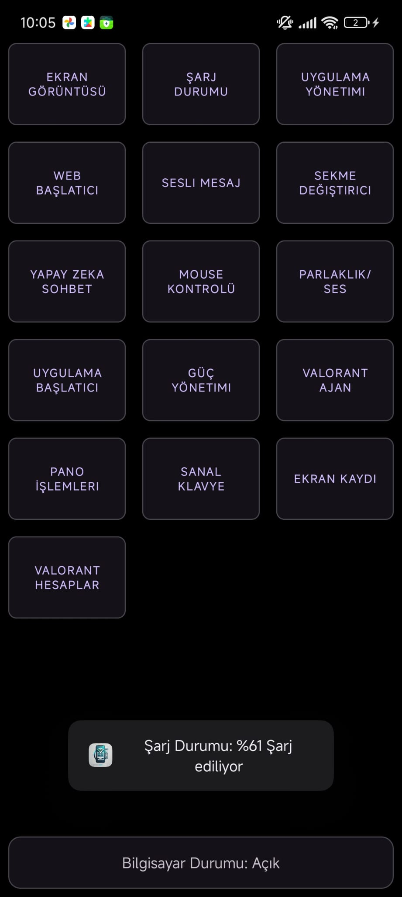
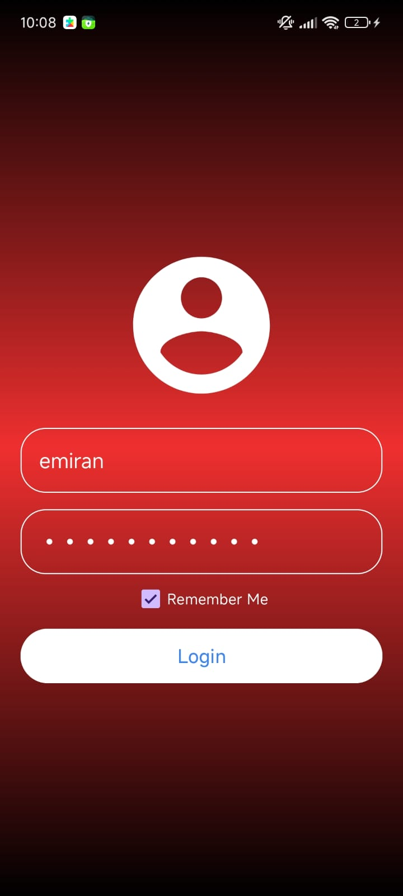

[Türkçe haline ulaşmak için buraya tıklayınız](Readme.MD)

> **⚠️ Attention:**
> Since it is still under development and contains personal information with many API keys, the source codes are not yet fully available. This repo will only be used for informational purposes about developments.

# WebSocket Server

This project is a Node.js application that performs functions of taking screenshots and transmitting charge status information to the client via a WebSocket server. Its main purpose is to control your computer with your phone. Users can take screenshots and get information about their device's battery status by sending specific messages. More features will be added over time.



### Feature List

1. **User Login**

- [x] Login with username and password.
- [x] Display a welcome message to the user on successful login.
- [x] Display an error message on failed login.
  
  

1. **Screenshot Feature**

   - [x] Process the `needScreenshot` purpose coming through WebSocket.
   - [x] Send the screenshot to the client in base64 format.
   - [ ] The image quality is low, improve the quality.

   

2. **Charge Status Feature**

   - [x] Process the `needChargeStatus` purpose coming through WebSocket.
   - [x] Send the device's battery level and charge status to the client.

3. **Application Management**

   - [x] Process the `needAppList` purpose coming through WebSocket and send the list of open applications to the client.
   - [x] Process the `needDestroyApp` purpose coming through WebSocket and close the requested application.
   - [x] Apply a filter to the application list sent to the `needAppList` purpose (to not send system applications).

4. **Web Launcher**

- [x] Open the link coming with the `needWebLink` purpose in the default browser on the computer.

6. **MessageBox**

- [x] Display the message coming with `needMsgBox` with a msgbox.

7. **Tab Switching**

- [x] Process the message coming with `needSwitchTab` and open the desired tab.

8. **AI Chat**

- [x] Users can chat with AI.
- [x] Users can call functions with AI.

  

9. **Mouse Control**

- [x] Process the message coming with `needMouseControl` and perform the desired mouse operations.

10. **V/B Adjuster**

- [x] Process the message coming with `needSetVolume` (a value between 0-100) and change the volume by the desired amount.
- [x] Process the message coming with `needSetBrightness` (a value between 0-100) and change the brightness by the desired amount.

11. **Application Launcher**

- [x] Process the message coming with `needStartApp` and start the desired application.

12. **Power Management**

- [x] Process the message coming with `needShutDown` (in seconds) and shut down the computer.
- [x] Restart the computer when the `needRestart` purpose is sent.
- [x] Lock the computer when the `needLockWorkspace` purpose is sent.
- [x] Cancel the shutdown process when the `needCancelShutdown` purpose is sent.

13. **Valorant Agent Locker**

- [x] Process the agent coming with the `needLockAgent` purpose and lock the desired agent in the agent selection part on the computer.

14. **Clipboard Operations**

- [x] Process the `needGetCb` purpose and send the last copied item on the computer's clipboard to the client with `sendGetCb`.
- [x] Copy the text entered on the phone to the computer's clipboard with `needSendCb`.

15. **Text Operations**

- [x] Process the message coming with `needPressCombination` and press the desired keys (For example, if the response is "ctrl alt del", the "Ctrl+Alt+Del" combination is applied)
- [x] Write the message coming with `needWriteText` as if typing from the keyboard.

16. **Screen Recording**

- [x] Process the message coming with `needScreenRecord` (integer) and start screen recording for the desired duration, when the recording is finished, the user is directed to the link where they can access the video.

17. **Valorant Account Loginer**

- [x] Process the account information coming with the `sendingValorantAccount` purpose and log in to Valorant.

## Required Dependencies

This application depends on the following Node.js packages:

- `ws`: To create a WebSocket server.
- `systeminformation`: To get system information (battery status, etc.).
- `screenshot-desktop`: To take screenshots.
- `robotjs`: For mouse control.
- `@google/generative-ai`: For AI chat feature.
- `clipboardy`: For clipboard operations.
- `open`: To open web links.

To install the dependencies, you can run the following command:

```bash
npm install
```

## Usage

1. **Starting the WebSocket Server:**

   You can use the following command to start the WebSocket server:

   ```bash
   node server.js
   ```

2. **Establishing Connection:**

   Once the server is started, the client can connect via WebSocket to perform operations.

3. **WebSocket Messages:**

   The server performs different operations based on incoming messages:

   - `needScreenshot`: Takes a screenshot and sends it in base64 format.
   - `needChargeStatus`: Sends battery level and charge status information.
   - `needAppList`: Sends a list of running applications.
   - `needDestroyApp`: Closes the requested application.
   - `needWebLink`: Opens the sent link in the default browser.
   - `needLockAgent`: Locks the desired agent in Valorant.
   - `needValoAccount`: Logs into the Valorant account.
   - `needGetCb` / `needSendCb`: Performs clipboard operations.
   - `needMsgBox`: Displays a MessageBox.
   - `needShutDown`: Shuts down the computer.
   - `needRestart`: Restarts the computer.
   - `needLockWorkspace`: Locks the computer.
   - `needPressCombination`: Performs key combinations.
   - `needWriteText`: Writes text.
   - `needSwitchTab`: Switches between tabs.
   - `needSetVolume`: Adjusts the volume level.
   - `needSetBrightness`: Adjusts the screen brightness.
   - `needScreenRecord`: Takes a screen recording.
   - `needStartApp`: Launches an application.
   - `mouseTasks`: Provides mouse control.
   - `needAIResponse`: Chats with AI.

4. **Message Format:**

   The client can send messages to the server in the following format:

   ```json
   {
     "user_id": "unique_id",
     "purpose": "command_name",
     "message": "command_parameter"
   }
   ```

5. **Response Format:**

   Responses from the server are in the following format:

   ```json
   {
     "user_id": "unique_id",
     "purpose": "response_type",
     "message": "response_data"
   }
   ```

## Configuring the WebSocket Server

The WebSocket server runs at `ws://localhost:12384`. Clients can connect to this address to receive services from the server.

When the server is started, you will receive an output like the following:

```
WebSocket server is running on port 12384.
New connection received
```

## Debugging and Logs

The application logs every incoming message and the result of the operation to the console. It provides information about incorrect message formats or operation errors.

### Example Error Message:

```
Error while taking screenshot: <error_details>
```

## Contributing

This project is open source. If you want to contribute, you can contribute by sending a pull request.

## License

This project is licensed under the MIT License. For more information, see the [LICENSE](LICENSE) file.

## Disclaimer

This software should only be used for legal and ethical purposes. Actions such as taking screenshots, recording screens, closing applications, or making changes to the system without user permission may be illegal and constitute a privacy violation. It is the responsibility of users to comply with local laws and regulations during the use of this software. The software developers do not accept any legal responsibility that may arise from the misuse of this software.
